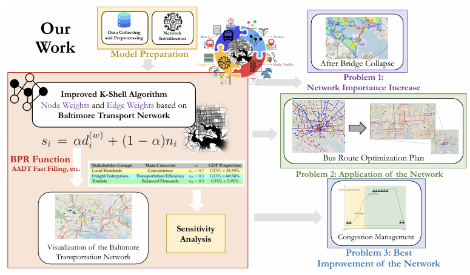
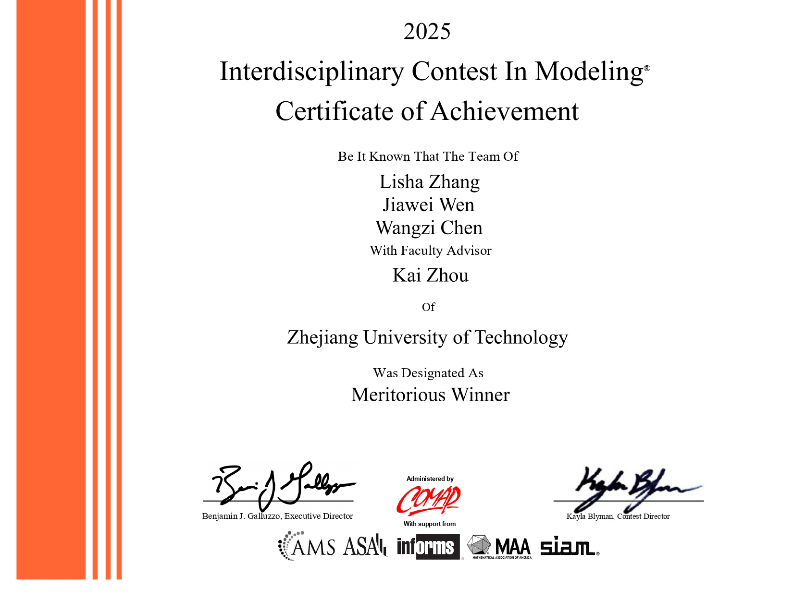

# 2025 ICM Problem D Introduction



This paper focuses on the infrastructure issues in Baltimore's transportation network and proposes an integrated analytical framework combining multiple algorithms. Based on an **improved K-Shell algorithm** — which incorporates node net passenger flow weights and road travel time weights derived from the BPR function — we construct a node importance evaluation model. Using the **K-Prototypes clustering algorithm**, we optimize public transit route planning and recommend the addition of key commuter routes. By integrating the **LWR** model, we establish an exponential growth prediction mechanism for traffic congestion and develop dynamic management strategies. The study verifies the model's robustness and demonstrates its stability via sensitivity analysis on parameter α. This approach provides a spatially adaptable solution for urban transportation network optimization.

本文聚焦巴尔的摩交通网络的基础设施问题，提出融合多算法的综合分析框架：基于改进的K-Shell算法（引入节点净客流量权重与BPR函数推导的道路通行时间权重），构建节点重要性评估模型；通过K-Prototypes聚类算法优化公交线路规划，建议新增关键通勤线路；结合LWR模型建立交通拥堵指数增长预测机制，并制定动态管理策略。研究最终通过参数α的敏感性分析证明模型稳定性，为城市交通网络优化提供了空间适应性解决方案。

# Team Members / 团队成员



This paper was completed by three members from Zhejiang University of Technology:  **Wangzi Chen** , **Jiawei Wen** , and **Lisha Zhang** , and it won the Meritorious Winner (International First Prize) in ICM 2025 . Among them, Lisha Zhang was elected as the team leader (#2500387) due to her need for award recognition, and she was responsible for most of the coding. Jiawei Wen handled the modeling and initial draft of the paper, while Wangzi Chen was in charge of visualization, translation, LaTeX layout, and final review. **All three contributed equally to the project.**

本文由浙江工业大学的**陈王子**, **温家伟**和**张莉莎**三位成员共同完成，并荣获 ICM2025 的 Meritorious Winner（国际一等奖）。其中张莉莎被选举为 #2500387 队长，她负责了大部分代码；温家伟负责了建模和论文底稿；陈王子则负责作图、翻译、排版设计和最后的审阅；**三者贡献均等。**

# Files / 项目文件

```
│  README.md
│  正文-zh.md
│
├─baltimore
│  ├─cn
│  │  │  basic.md
│  │  │  essay.aux
│  │  │  essay.bbl
│  │  │  essay.log
│  │  │  essay.out
│  │  │  essay.pdf
│  │  │  essay.synctex.gz
│  │  │  essay.tex
│  │  │  letter.docx
│  │  │  ref.bib
│  │  │
│  │  └─figures
│  │          3stage.pdf
│  │          busroute.pdf
│  │          cluster.png
│  │          data.pdf
│  │          heatmap.png
│  │          heatmapbefore.png
│  │          intro.pdf
│  │          letter.pdf
│  │          topo1.pdf
│  │          topo2.pdf
│  │          topo3.pdf
│  │          vis.png
│  │          zongshu.pdf
│  │
│  ├─eng
│  │  │  2500387.pdf
│  │  │  mcmthesis.aux
│  │  │  mcmthesis.bbl
│  │  │  mcmthesis.log
│  │  │  mcmthesis.out
│  │  │  mcmthesis.synctex.gz
│  │  │  mcmthesis.tex
│  │  │  mcmthesis.toc
│  │  │  ref.bib
│  │  │
│  │  └─figures
│  │          3stage.pdf
│  │          busroute.pdf
│  │          cluster.png
│  │          data.pdf
│  │          heatmap.png
│  │          heatmapbefore.png
│  │          intro.pdf
│  │          letter.pdf
│  │          ourwork.pdf
│  │          topo1.pdf
│  │          topo2.pdf
│  │          topo3.pdf
│  │          vis.png
│  │          zongshu.pdf
│  │
│  └─pic
│      │  baltimore_traffic_heatmap.html
│      │  bridge.py
│      │  busroute.pdf
│      │  data.pdf
│      │  data.pptx
│      │  heatmap.PNG
│      │  intro.pdf
│      │  intro.pptx
│      │  letter.docx
│      │  letter.pdf
│      │  MDOT_SHA_Annual_Average_Daily_Traffic_Baltimore.csv
│      │  ourwork.pdf
│      │  topo.pdf
│      │  topo.pptx
│      │  zongshu.pdf
│      │  zongshu.pptx
│      │
│      └─cache            
│
└─pic
        2500387.jpg
        data_from.png
        data_look.png
        KP.png
        our_work.png
        quick_fill-1.png
        quick_fill-2.png
        quick_fill-3.png
        result.png
        文献方法对比与改进思路图.png
        问题背景.png
```

# Blog / 相关博客

[2025数模美赛 - 阿伟的博客网站](https://ahhhhwei.github.io/2025/05/04/2025数模美赛/)
