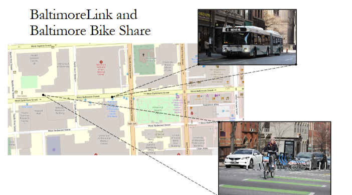
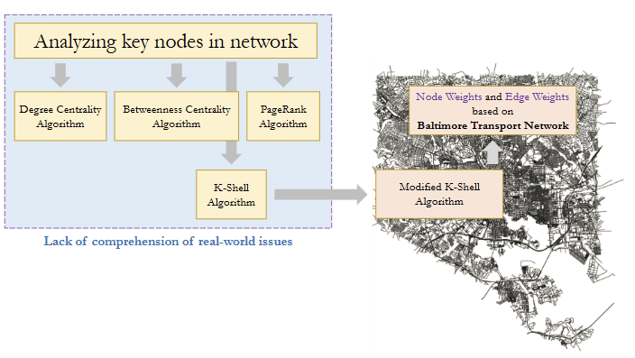
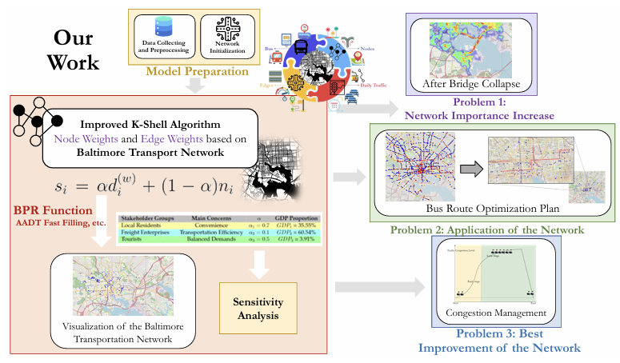
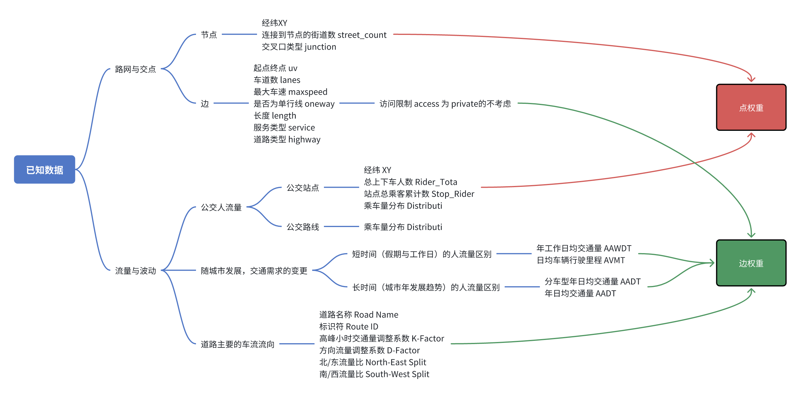
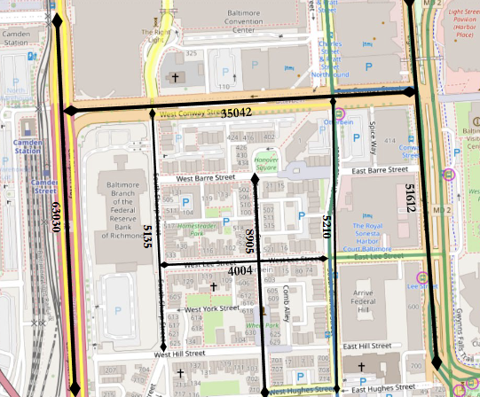
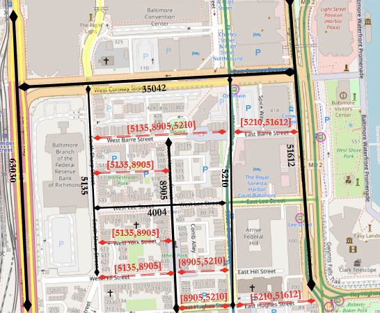
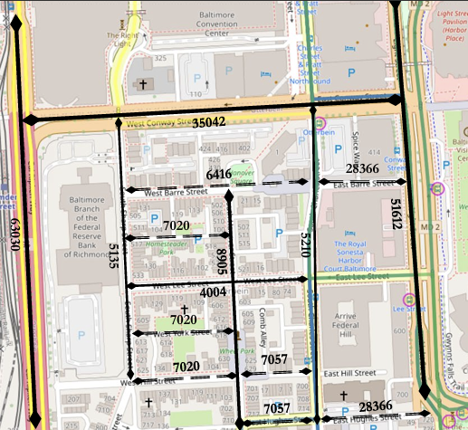
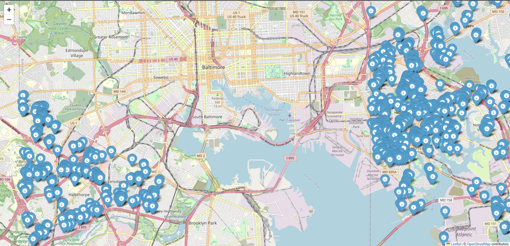
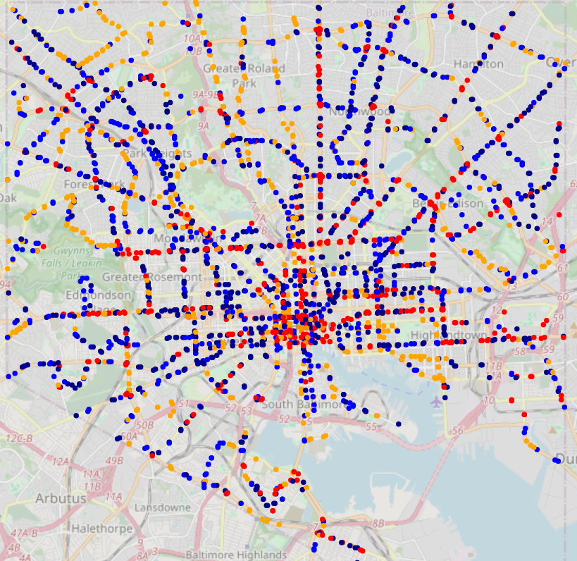
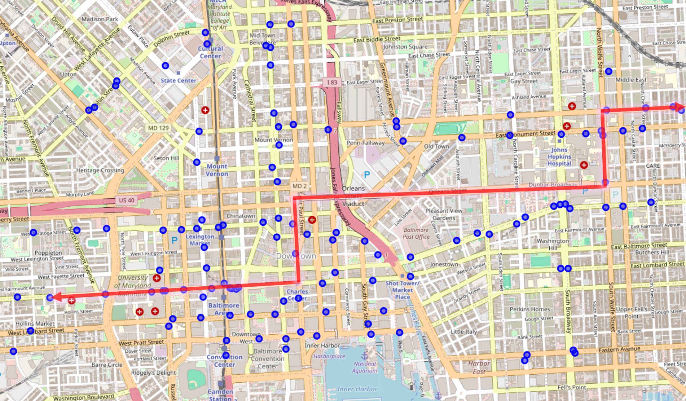

# D题

## 摘要

交通网络与城市的发展息息相关，它影响着人们的日常生活、货物商品等的运输效率和城市的经济发展等方面。巴尔的摩市交通网络深受基础设施老化的影响，为交通网络的畅通带来了安全隐患。针对巴尔的摩市因弗朗西斯·斯科特·基桥坍塌引发的交通网络危机，本文构建了交通网络分析模型，并提出具有空间适应性的优化策略。

首先，我们的交通网络通过计算节点的重要性来分析交通。由于传统算法往往会忽略实际网络情况，只考虑网络的拓扑结构，所以我们创新性地改进了传统K-Shell节点重要性评估算法。我们把K-Shell算法中节点的“度”替换为节点的加权度和节点自身权重的组合，其中点权重主要通过节点的净人流量来确定，边权重则是由 BPR 函数推导的道路平均通行时间来确定。考虑到不同利益者对交通网络有着不同的需求，我们将其概括为三类人群，并调研了不同利益相关方群体的 GDP 占比，这使我们建立的模型更加完善全面。

根据问题1，我们把模型应用在了弗朗西斯·斯科特·基桥的倒塌前后的分析上，我们对比了大桥倒塌前后的节点重要性变化，发现I-895隧道、I-95隧道及内陆绕行的线路的重要性提升明显，并且我们还评估了大桥倒塌对各方利益相关者的影响。

根据问题2，我们分析了巴尔的摩的公交线路情况。我们首先采用KP聚类算法对公交站相关的数据进行了聚类，然后我们选取了其中一类进行分析。我们借助交通网络模型的节点重要性以及公交线路数量和公交站的客流量，认为巴尔的摩市应该增加如图？红线所示线路。

根据问题3，我们首先分析了巴尔的摩交通网络拥堵的安全隐患，然后我们根据LWR模型和节点重要性分数确定了交通拥堵的指数增长模型，最后我们根据交通拥堵“前期指数增长，后期增长缓慢”的特点制定了拥堵管理策略。

最后，我们对 k-shell算法的参数 $$\alpha$$ 做了灵敏度分析，阐释了模型的健壮性。

**关键词：交通网络、k-shell、BPR、k-prototypes**

<h1 style="text-align: center;">目录</h1>

## 一、引言

### 1.1 问题背景

交通网络堪称城市的脉络，关乎着一个城市的发展和居民的生活水平，美国马里兰州巴尔的摩市同样如此。受到原有老化的基础设施和有限的交通选择的影响，巴尔的摩市政府正着眼于重新设计和优化其交通系统，以促进城市发展和利益相关者各方的生活水平和满意度，同时适应未来的需求并确保可持续发展。



### 1.2 问题重述

根据问题背景信息，我们需要建模巴尔的摩市的交通网络，改善利益相关者们的通勤。主要分为以下任务：

1. 根据题目所给数据，建模巴尔的摩市交通网络并将其可视化。
2. 分析弗朗西斯·斯科特·基桥的倒塌对巴尔的摩的交通系统产生的影响，并分析各个利益相关者的影响。
3. 选择一个影响公交系统或人行道系统的项目，分析我们的巴尔的摩交通网络模型对其的影响，并分析对各个利益相关者的影响。
4. 推荐一个最能改善巴尔的摩居民生活的交通网络项目，并对其分析。

### 1.3 文献综述

根据 1.2 节问题重述所述，我们查找了大量文献。

针对分析网络结构中的关键节点的方法主要是基于网络物理结构的中心化方法：度中心算法、介数中心性算法、K-Shell 算法、 PageRank 算法等。但这些方法都从单一方面寻找反映节点重要程度的因素，没有考虑到实际问题中各个指标的影响，不能充分挖掘网络隐含的特征，因此关键节点识别结果不是很准确。本文基于这些方法，提出了一种基于节点和边权重改进的 K-shell 分解算法，并取得了令人兴奋的结果。



<h6 style="text-align: center;">文献方法对比与改进思路图</h6>

### 1.4 our work



## 二、假设和解释

**假设1：**假设公交站点的客流量可以在一定程度上反映附近的人流量，且乘客下车后客流量均匀分配到道路两侧；

**假设2：**假设巴尔的摩城市中access=private的私有路段不属于城市交通网络的一部分；

**假设3：**假设在考虑巴尔的摩公交站点线路时，数据集中rider_total可以充分代表客流量。

## 三、符号

|    符号     |           含义           |
| :---------: | :----------------------: |
| $d_i^{(w)}$ |       节点加权度数       |
|    $n_i$    |         节点权重         |
|    $s_i$    |         节点评分         |
|  $\alpha$   |   d_i^{(w)} 的比例系数   |
|    score    | 公交线路优化模型评价分数 |
| $\rho(x,t)$ |         交通密度         |

## 四、巴尔的摩交通网络模型

### 4.1 网络模型的表示

根据文献综述，传统方法建立交通网络模型时大多数仅仅依靠网络的拓扑结构分析节点的重要性，而忽略城市的实际情况（如客流量、天气、地理地形等）所以我们提出一种基于点边权重的 k-shell 模型。权重主要代表了各方的利益，**见表**，这不仅考虑了图网络的拓扑结构，而且还考虑了城市的实际情况。我们把城市交通抽象为一个复杂网络 $G=(V,E)$，其中 $|V|=N, |E|=M,E\subseteq V\times V$。城市中道路的交叉口或断点定义为网络 $G$ 中的点，记为 $V=\{v_1, v_2, \ldots, v_N\}$，点的数量记为 $N$，城市中所有的道路定义为网络 $G$ 中的边，记为 $E= \{e_1, e_2, \ldots, e_M\}$，边的数量记为 $M$。

### 4.2 基于巴尔的摩现况的改进节点权重和边权重的K-shell分解算法

给定一个带有节点和边权重的有向图 $$G = (V, E)$$，其中 $$V$$ 是节点集合，$$E$$ 是边集合。每条边 $$e_{ij} \in E$$ 具有权重 $$w_{ij}$$，每个节点 $$v_i \in V$$ 具有权重 $$n_i$$。

#### 4.2.1 已知数据的分类讨论

我们对巴尔的摩数据项可划分为两类，一类描述路网和交点，另一类描述交通流量及其波动。它们当中有些项和节点权重相关，有些项则与边权重相关。可划分如下：



#### 4.2.2 算法流程

给定一个带有节点和边权重的有向图 $ G = (V, E) $，其中 $ V $ 是节点集合，$ E $ 是边集合。每条边 $ e_{ij} \in E $ 具有权重 $ w_{ij} $，每个节点 $ v_i \in V $ 具有权重 $ n_i $。

输入：图网络$ G = (V, E) $

输出：节点重要性排序结果

1. 首先计算每个节点的初始加权度数 $d_i^{(w)}=\sum_{j\in N(i)}w_{ij}$，其中 $N(i)$ 表示节点 $i$ 的邻接节点集合

2. 然后对于每个节点 $i$，计算综合评分 $s_i=\alpha d_i^{(w)}+ (1-\alpha)n_i$，**$$\alpha$$ 作为调节参数，可体现不同利益相关者对交通网中点权重与边权重的需求优先级，具体确定过程见4.4节。**此处的 $d_i^{(\omega)}$ 和 $n_i$ 都经过最小最大归一化。

3. 迭代移除低评分节点

   - 找出当前图中具有最低综合评分的节点集合 $S$。

   - 将这些节点分配到当前的K-shell层，并从图中移除这些节点。

   - 更新剩余节点的加权度数

     $d_j^{(w)}=d_j^{(w)}-w_{ij}\quad\text{对于所有 }j\in N(i)$

4. 对剩余的图重复上述步骤，直到所有节点都被分配到某个 K-shell 层。

### 4.3 节点和边权重的确定

#### 4.3.1 点权重的确定

点权重主要考虑政府方面，当某节点的人流量增大后，可以促进当地的经济发展，推动旅游业，增大企业活力。因此点权重我们以节点的净流量为标准。

根据假设1，乘客上下车方向均匀分配，有：

- 上车乘客以 $ \frac{U_{uv}}{2} $ 的比例分别从节点 $ u $ 和 $ v $ 进入道路，$U_{uv}$ 表示在该站点进入道路的乘客总数

- 下车乘客以 $ \frac{D_{uv}}{2} $ 的比例分别前往节点 $ u $ 和 $ v $，$D_{uv}$ 表示在该站点离开道路的乘客总数

我们定义某节点 $ u $ 的相邻边集合为 $\mathcal{E}$，首先计算节点流出量（从节点离开的乘客）和节点流入量（到达节点的乘客）：
$$
\begin{cases}
\text{Outflow}(i) = \frac{1}{2} \sum_{(i, j) \in \mathcal{E}} U_{ij}\\
\text{Inflow}(i) = \frac{1}{2} \sum_{(j, i) \in \mathcal{E}} D_{ji}
\end{cases}
$$
最后我们计算节点净流量为：
$$
\text{Net}(i) = \text{Inflow}(i) - \text{Outflow}(i)=\frac{1}{2} \sum_{(i, j) \in \mathcal{E}} U_{ij}-\frac{1}{2} \sum_{(j, i) \in \mathcal{E}} D_{ji}
$$

#### 4.3.2 边权重的确定

边权重主要由居民、游客、过境旅客的通行时间来衡量，我们从数据文件中收集出与边权重相关指标：道路类型、道路段上车道数量、道路上的最大速度限制、道路是否为单向、道路长度、道路宽度、车道数等，由此建立以下模型：

BPR 函数描述了行程时间与交通流量的关系：


$$
t = t_0 \left(1 + \alpha \left(\frac{V}{C}\right)^\beta\right)
$$
其中：

- $ t $：实际行程时间，
- $ t_0 $：自由流时间（无拥堵时的行程时间），
- $ V $：交通流量（如 AADT，年度平均日交通量），
- $ C $：道路通行能力，
- $ \alpha, \beta $：经验参数（通常取 $ \alpha=0.15 $, $ \beta=4 $）。

根据 BPR 函数，我们可以得出，实际速度 $ v $ ：
$$
v = \frac{L}{t} = \frac{L}{t_0 \left(1 + \alpha \left(\frac{V}{C}\right)^\beta\right)},
$$
其中 $ L $ 为道路长度。自由流速度 $ v_0 = \frac{L}{t_0} $，因此：
$$
v = \frac{v_0}{1 + \alpha \left(\frac{V}{C}\right)^\beta}.
$$

此外，通行能力 $ C $ 受以下因素影响：

- **车道数（`lanes`）**：每车道通行能力参考值。
- **道路功能分类（`Functional Class`）**：
  - 州际公路：$ C = 50,000 $ 辆/日，
  - 主干道：$ C = 30,000 $ 辆/日，
  - 地方道路：$ C = 10,000 $ 辆/日。

最后我们引入其他调整因子

- 道路特征修正

  - **隧道（`tunnel=yes`）**：速度降低15%，即 $ v_{\text{final}} = v \times 0.85 $。

  - **桥梁（`bridge=yes`）**：速度降低10%，即 $ v_{\text{final}} = v \times 0.9 $。

  - **单向道路（`oneway=True`）**：速度提高5%，即 $ v_{\text{final}} = v \times 1.05 $。


- 车道数影响

  车道数越多，通行效率越高：
  $$
  C = C_{\text{base}} \times \text{lanes}.
  $$

综合所有因素后，我们可以得出：
$$
v_{\text{final}} = \frac{v_0}{1 + \alpha \left(\frac{\text{AADT}}{C}\right)^\beta} \times f_{\text{tunnel}} \times f_{\text{bridge}} \times f_{\text{oneway}},
$$

其中：

- $f_{\text{tunnel}} = 1 - 0.15 \times \text{is\_tunnel}$，$\text{is\_tunnel}\in\{0,1\}$
- $f_{\text{bridge}} = 1 - 0.1 \times \text{is\_bridge}$，$\text{is\_bridge}\in\{0,1\}$
- $f_{\text{oneway}} = 1 + 0.05 \times \text{is\_oneway}$，$\text{is\_oneway}\in\{0,1\}$

最终，边的权重由通行时间来确定：
$$
t=\frac{L}{v_{final}},
$$
其中，$L$ 表示道路长度。

### 4.4 由利益相关方确定参数 $$\alpha$$

我们分析巴尔的摩市的情况后，把利益相关方划分为以下几个群体，并根据他们的自身工作或生活特性确定他们的 $$\alpha$$，如下表所示，其中GDP 数据来源见附录12.1：

| 利益相关者群体 | 主要关注点 |  $\alpha$ 值   |     2023年GDP（$）      |    GDP 占比     |
| :------------: | :--------: | :------------: | :---------------------: | :-------------: |
|    本地居民    |   便利性   | $\alpha_1=0.7$ | 64357*565239=363.7709亿 | $GDP_1=35.55\%$ |
|    货运企业    |  运输效率  | $\alpha_2=0.1$ |       619.5397亿        | $GDP_2=60.54\%$ |
|      游客      |  平衡需求  | $\alpha_3=0.5$ |          40亿           | $GDP_3=3.91\%$  |

然后我们建立综合网络重要性比例系数：
$$
\alpha_{\text{总}}=\sum_{i=1}^{n}\omega_i\cdot\alpha_i,\quad i=1,2,3,
$$
其中，$$\omega_i$$ 为利益相关者群体的权重，由 GDP 占比确定：
$$
w_i=GDP_i
$$
带入计算后得到最终权重为：$\alpha_{\text{总}}=0.32534$

### 4.5 数据预处理

#### 4.5.1 数据的选择与整理

由于题目所给数据地理范围远大于巴尔的摩市的范围，所以我们首先根据经纬度筛选出巴尔的摩市范围内的数据，筛选结果如表所示：

| 数据表 | edge_all.csv | edge_drive.csv |
| ------ | ------------ | -------------- |
| 筛选前 | 565495条     | 91227条        |
| 筛选后 | 201003条     | 29309条        |

#### 4.5.2 快速填充算法确定AADT

因为只有在站点的道路上才收集到AADT数据，而其他道路没有，为此我们用以下算法确定所有道路的AADT值

- step1：所有边AADT赋值为0，并更新有站点的边的AADT；
- step2：遍历已被赋值过AADT的边，对于每个这样的边 $e_i$，遍历与其相连的边 $e_j$，把 ${e_i}$ 的 AADT 添加到 ${e_j}$ 的AADT列表；
- step3：计算 step2 中 $e_j$ 的 AADT 列表的平均值，作为 $e_j$ 的 AADT；
- step4：循环执行 step2、step3，直至整个网络中没有AADT值为0的边

图?.a-?.c显示了快速填充算法循环一轮的过程：

<table border="1" style="width: 100%; text-align: center;">   <tr>     <th>步骤 1</th>     <th>步骤 2</th>     <th>步骤 3</th>   </tr>   <tr>     <td></td>     <td></td>     <td></td>   </tr> </table>

#### 4.5.3 权重数据的规范化处理

根据公式？，点权重和边权重加权求和后得到改进的 K-shell 分解算法的综合评分，为了消除数据指标之间量纲和取值范围的影响，使不同指标之间具有可比性，我们需要首先对计算得到的点权重和边权度数进行最小-最大规范化处理：
$$
x_i' = \frac{x_i - \min(x)}{\max(x) - \min(x)},
$$
其中，$$x_i'$$ 是第 $$i$$ 个进行最小-最大规范化的数据点。

### 4.6 数据可视化

我们根据巴尔的摩城市交通网络模型，计算出重要性在前1000名的节点，并可视化，结果如下图所示：



## 五、问题1：交通网络模型应用于弗朗西斯·斯科特·基桥倒塌

2024年3月26日，一起交通事故导致弗朗西斯·斯科特·基大桥坍塌，造成交通瘫痪。事实上，历史上有很多导致交通网络瘫痪的案例，如下表所示：

| 事件               | 时间    | 原因         | 影响                               |
| ------------------ | ------- | ------------ | ---------------------------------- |
| 巴西圣保罗堵车事件 | 2009.06 | 自然灾害     | 840公里交通道路瘫痪                |
| 莫斯科暴雪事件     | 2012.12 | 自然灾害     | 数千名司机被困在暴风雪中           |
| 巴西世界杯堵车事件 | 2014.05 | 交通流量突增 | 圣保罗市交通全面瘫痪               |
| 中国安徽堵车事件   | 2023.09 | 交通事故     | 30000多辆车困在高速公路上超过8小时 |

我们团队根据？节建立好的巴尔的摩市交通网络模型，分析大桥坍塌前后的节点重要性变化，发现在大桥坍塌后，邻近道路节点（如I-95隧道、I-895隧道）的重要性评分上升，成为替代路径的拥堵热点。我们分别计算出大桥坍塌前后巴尔的摩市交通网络的节点重要性评分，然后借此画出大桥坍塌后节点重要性提升百分比热力图，结果显示1-895隧道重要性提升最明显，在63.7%左右，1-95隧道次之，约为47.2%，城市中绕行的道路平均也有10%20%的提升。这也说明了巴尔的摩城市交通网络中的问题：路径冗余不足、多模式衔接断裂。

热力图

然后，我们根据本地居民、货运企业、游客三种不同利益者的 $$\alpha$$ 值分别计算巴尔的摩城市交通网络节点重要性提升情况，结果如下表所示。我们发现，在弗朗西斯·斯科特·基大桥坍塌前后，本地居民利益者的巴尔的摩交通网络节点重要性变化幅度很少，这是因为本地居民活动范围相对固定，一般不会去对岸。而游客次之，这是因为他们去对岸的可能性比本地居民大。货运企业最高，因为他们要频繁来往两岸。此外，值得注意的是，由于1-895隧道和1-95隧道可能对来往车辆有着限制，他们不得不在城市中绕行，所以城市绕行的重要性提升百分比相对较高。

| 利益相关者群体 | 1-895隧道 | 1-95隧道 | 城市内绕行 |
| -------------- | --------- | -------- | ---------- |
| 本地居民       | 62.375    | 46.046   | 18.901     |
| 游客           | 64.528    | 47.568   | 15.679     |
| 货运企业       | 64.796    | 48.586   | 12.179     |

## 六、问题2：交通网络模型应用于优化公交线路

### 6.1 基于 PCA 的特征权重分析

#### 6.1.1 数据选择与处理

在公交站点数据集（`Bus_Stops.csv`）中，我们需要对公交站点的特征进行分析，确定每个特征对聚类结果的贡献权重，并基于这些权重进行聚类。经过筛选，我们除去了一些无意义、含义重复、数据单一的列后，选择数据指标如下：

| 数据类型 | 数据含义   |
| -------- | ---------- |
| 数值型   | Rider_Tota |
| 数值型   | Stop_Rider |
| 类别型   | Mode       |
| 类别型   | Shelter    |

由于类别型特征无法直接用于 PCA，我们首先对其进行 One-Hot 编码，然后通过 PCA 分析确定每个特征的权重。PCA 对数据的尺度敏感，因此需要对数值型特征进行标准化。标准化公式为：

$$
z = \frac{x - \mu}{\sigma}
$$
其中：$$x$$ 是原始数据，$$ \mu $$ 是均值，$$ \sigma $$ 是标准差。

#### 6.1.2 主成分分析

标准化后的数据矩阵为 $$ \mathbf{X} \in \mathbb{R}^{n \times p} $$，其中 $$ n $$ 是样本数，$$ p $$ 是特征数。协方差矩阵 $$ \mathbf{C} $$ 的计算公式为：
$$
\mathbf{C} = \frac{1}{n-1} \mathbf{X}^T \mathbf{X}
$$
对协方差矩阵 $$ \mathbf{C} $$ 进行特征值分解：

$$
\mathbf{C} = \mathbf{V} \mathbf{\Lambda} \mathbf{V}^T,
$$
其中：$$ \mathbf{V} $$ 是特征向量矩阵，$$ \mathbf{\Lambda} $$ 是特征值对角矩阵。

主成分 $$ \mathbf{P} $$ 是原始数据在特征向量方向上的投影：

$$
\mathbf{P} = \mathbf{X} \mathbf{V}
$$
每个主成分的方差贡献率为：

$$
\text{Explained Variance Ratio}_i = \frac{\lambda_i}{\sum_{j=1}^p \lambda_j},
$$
其中 $$ \lambda_i $$ 是第 $$ i $$ 个特征值。

#### 6.1.3 特征权重计算

对于类别型特征（如 `Routes_Ser`、`Mode`、`Shelter`），我们使用 One-Hot 编码将其转换为二进制向量。假设类别型特征 $$ \mathbf{C} $$ 有 $$ k $$ 个取值，则 One-Hot 编码后的特征矩阵为：
$$
\mathbf{C}_{\text{encoded}} \in \mathbb{R}^{n \times k}
$$
将标准化后的数值型特征 $$ \mathbf{X}_{\text{scaled}} $$ 和 One-Hot 编码后的类别型特征 $$ \mathbf{C}_{\text{encoded}} $$ 合并：

$$
\mathbf{X}_{\text{processed}} = [\mathbf{X}_{\text{scaled}}, \mathbf{C}_{\text{encoded}}]
$$
对合并后的数据 $$ \mathbf{X}_{\text{processed}} $$ 进行 PCA 分析，得到每个主成分的方差贡献率 $$ \text{Explained Variance Ratio}_i $$。将 One-Hot 编码后的特征的方差贡献合并回原始类别。假设原始类别型特征 $$ \mathbf{C} $$ 的 One-Hot 编码列对应的方差贡献为 $$ \text{Explained Variance Ratio}_j $$，则原始类别的权重为：

$$
\text{Weight}_i = \sum_{j \in \text{Category}_i} \text{Explained Variance Ratio}_j
$$
将权重归一化，使其总和为 1：
$$
\text{Normalized Weight}_i = \frac{\text{Weight}_i}{\sum_{j=1}^p \text{Weight}_j}
$$
至此，我们计算出了表？所示数据的权重，结果如下：

| 数据含义   | 权重                  |
| ---------- | --------------------- |
| Rider_Tota | 0.7634882543463637    |
| Stop_Rider | 0.17961564692082388   |
| Mode       | 0.05551902771472677   |
| Shelter    | 0.0013770710180857288 |

### 6.2 k-prototypes算法聚类

K-Prototypes 算法是一种能够同时处理数值型和类别型数据的聚类方法。如 **表 ?** 所示，我们的数据集包含数值型特征（如 `Rider_Tota` 和 `Stop_Rider`）和类别型特征（如 `Mode` 和 `Shelter`），完全符合 K-Prototypes 算法的要求。此外，我们在 **6.1 节** 中通过 PCA 分析计算了每个特征的权重贡献，这些权重将用于优化聚类过程。K-Prototypes 聚类算法具体过程如下：

1. 随机选择 $$k $$ 个初始中心点，每个中心点包含数值型和类别型特征的初始值；
2. 对于数据集中的每个样本点，计算其与 $$k $$ 个中心点的加权距离（数值型特征使用加权欧氏距离：$$d_{\text{num}} = \sum_{i \in \text{数值型特征}} w_i \cdot (x_i - c_i)^2$$，类别型特征使用加权汉明距离：$$d_{\text{cat}} = \sum_{j \in \text{类别型特征}} w_j \cdot \mathbb{I}(x_j \neq c_j)$$，其中，$$w_i $$ 和 $$w_j $$ 分别为数值型和类别型特征的权重，$$x_i $$ 和 $$c_i $$ 分别为样本点和中心点的数值型特征值，$$x_j $$ 和 $$c_j $$ 分别为样本点和中心点的类别型特征值，$$\mathbb{I}(\cdot) $$ 是指示函数，当 $$x_j \neq c_j $$ 时取值为 1，否则为 0。）然后将样本点划分到距离最近的中心点所对应的类别中；
3. 对于每个簇，重新计算中心点：数值型特征使用加权均值作为新的中心点特征值（$$c_i = \frac{\sum_{x \in \text{簇}} w_i \cdot x_i}{\sum_{x \in \text{簇}} w_i}$$），类别型特征使用加权众数作为新的中心点特征值，即选择权重最大的类别；
4. 重复步骤 2 和步骤 3，直到中心点不再发生变化或样本点的类别分配不再改变时输出最终的聚类结果。

我们对巴尔的摩市公交站点数据进行聚类，多次选取不同的 k 值后，发现 k=5 时效果比较理想，聚类可视化结果如下图所示：



观察聚类结果图我们发现：

重要性最高的站点很大程度上集中在市中心部分，分布在繁忙的交通线路上。而重要性低的站点大多集中在距离市中心偏远的地区，分布在人流量少的交通线路上。因此，我们考虑选取重要性高的站点集中所在区域进一步分析。

### 6.3 分析聚类区域的公交线路情况

我们抽离出聚类结果中的一块进行分析，尝试为该区域增加公交线路规划。为此我们计算出每个站点对应的分数，在分数高的地方增加公交线路。除了第四节中的节点权重外，针对公交线路，我们还应关注客流量和公交线路数量对分数的影响：客流量越大，越应增加线路；而公交线路越少，越应增加线路。分数具体计算公式如下：

$$score=\dfrac{\text{客流量}\times \text{站点两侧节点重要性平均值}}{\text{公交线路数量}}$$

我们可视化出分数的结果，途中红线部分经过了许多家医院和一所大学，因此我们决定在图中红线位置应该增加线路。如图所示：



### 6.4 对周边地区利益相关者的影响

在地图中标注红线的地方新增公交线路后，极大地方便了周边居民的日常出行，同时也显著提升了旅客的出行体验；同时降低了大学学生等居民驾车出行的意愿，为货运公司提供了更便捷的物流通道。这一改进不仅加强了区域内的交通网络连接，还促进了当地经济的发展，使得居民、旅客以及企业均能从中受益。

## 七、问题3：巴尔的摩交通网络的拥堵管理策略

### 7.1 巴尔的摩市的安全隐患

城市的交通网络拥堵一直是巴尔的摩市的安全隐患，它不仅可能导致了交通事故发生概率的增加，而且交通不便的地区也可能因警力难以快速到达而导致犯罪率上升，此外，人流密集的地方也可能发生踩踏事故，也容易发生盗窃、抢劫等犯罪。为此我们团队设计了一套巴尔的摩交通网络的拥堵管理策略，类比计算机网络领域的拥塞控制算法，分阶段的动态调整信号灯周期和交警数量。

### 7.2 交通拥堵的指数模型

根据经典LWR模型描述交通密度 $$ \rho(x,t) $$ ，有：
$$
\frac{\partial \rho}{\partial t} + \frac{\partial}{\partial x} \left( \rho v(\rho) \right) = 0\Rightarrow v(\rho) = v_{\text{free}} \left( 1 - \frac{\rho}{\rho_{\text{max}}} \right)
$$
考虑到节点的重要性 $$ w_i $$ 削弱局部通行能力：
$$
\rho_{\text{max},i} = \rho_{\text{base}} \cdot \left( 1 - \alpha w_i \right)
$$
在局部路段（节点 $$i$$ 附近）,忽略空间导数项，LWR方程退化为Logistic方程：
$$
\frac{d\rho_i}{dt}=k_i\rho_i\left(1-\frac{\rho_i}{\rho_{\max,i}}\right)
$$
考虑到节点重要性越高，拥堵扩散可能越快。定义修正后的增长速率：
$$
k_i=k_\mathrm{base}\cdot(1+\beta w_i)
$$
带入后得：
$$
\frac{d\rho_i}{dt} = k_{\text{base}} (1 + \beta w_i) \rho_i \left( 1 - \frac{\rho_i}{\rho_{\text{base}} (1 - \alpha w_i)} \right)
$$
分离变量法求解上面这个方程：
$$
\rho_i(t) = \frac{\rho_{\text{max},i}}{1 + e^{-k_{\text{base}} (1 + \beta w_i) t} \cdot \left( \frac{\rho_{\text{max},i}}{\rho_{i,0}} - 1 \right)}
$$
当 $$ \rho_i \ll \rho_{\text{max},i} $$ 时：
$$
\rho_i(t) \approx \rho_{i,0} \cdot e^{k_{\text{base}} (1 + \beta w_i) t}
$$


当拥堵发生的前期，拥堵程度会随着时间程指数增长，到了某个临界值后，拥堵程度增长开始减慢，这和TCP协议的拥塞控制非常相似。因此我们提出以下拥堵管理策略：

- 阶段一：拥堵发生初期，拥堵程度随时间指数增长，这时应该在各大路口调整信号灯周期，迅速增加交警数量。
- 阶段二：拥堵发生中后期，拥堵程度增长减慢，所增派的交警数量也如此，
- 阶段三：拥堵结束后信号灯周期和交警数量恢复至正常水平。

- ### 7.3 交通拥堵管理策略对各方利益的影响

  我们将交通拥堵管理对巴尔的摩市各方利益者的影响总结如下表所示。巴尔的摩市的交通拥堵管理策略不仅方便了本地居民、游客和货运企业的出行，还对城市的安全方面产生了积极的影响。通过动态调整信号灯周期和增加交警数量，可以有效减少交通拥堵，提高出行效率和安全性，提升居民和游客的生活质量和旅游体验，降低货运企业的运输成本，促进城市的经济发展。

  | **利益相关者** | **出行方便**                             | **出行安全**               |
  | -------------- | ---------------------------------------- | -------------------------- |
  | 本地居民       | 出行时间缩短，出行选择增加，生活质量提升 | 交通事故减少，警力快速到达 |
  | 游客           | 出行便利性提高，旅游体验提升             | 踩踏事故减少，犯罪率降低   |
  | 货运企业       | 运输效率提高，运输成本降低               | 交通事故减少，货物安全提升 |

## 八、灵敏度分析

我们对 4.4节种计算的$$\alpha$$分别增加和减少 5% ，计算增加或减少后与原 $\alpha$ 的结果的均方误差，结果如下表所示

|        | $\alpha$ 值 | 均方误差  |
| ------ | ----------- | --------- |
| 原值   | 0.32534     | 不填      |
| 增加5% | 0.341607    | 14.209293 |
| 减少5% | 0.309073    | 8.608151  |

结果显示，对参数 $$\alpha$$进行微小扰动后，产生的差异在可接受的范围内，证明了我们的模型的鲁棒性。

## 九、优缺点

### 1.优点

**优点1：**加入点权重和边权重的改进后的 k-shell 分解算法可以从该市的实际交通情况和交通网络的拓扑结构等方面充分构建该市的交通网络图模型，较为全面；

**优点2：**点权重和边权重引入比例系数，分析并深入考虑了各个利益方的影响；

**优点3：**k-prototypes 算法聚类时，各个类型的权重由PCA算法确定，较为准确。

### 2.缺点与改进

**缺点1：**计算边权重时需要用到每条道路的AADT值，但是不是每条路都有站点，填充数据时若直接采用最短距离算法时间复杂度过高。

**改进1：**类似于计算机视觉领域的分水岭算法，我们团队构建一种快速填充缺失AADT值的算法，见4.2节。这种算法几乎以线性的时间复杂度完成了填充任务，满足对于大规模图网络数据的填充需求；

**缺点2：**k-means聚类算法根据欧氏距离计算相似度，无法处理类别类型数据。

**改进2：**K-Prototype是K-means的扩展版本，能够同时处理数值和类别型数据，能够很好地完成6.2中的聚类任务。

## 十、结论

本研究通过改进K-Shell算法，结合节点和边的实际权重（净人流量和道路平均通行时间），建立了巴尔的摩交通网络模型。应用该模型分析弗朗西斯·斯科特·基桥倒塌前后的情况，发现关键隧道（1-895隧道、1-95隧道）和绕行线路的重要性显著提升，并评估了对不同利益相关方的影响。进一步分析城市公交系统，利用K-Prototypes聚类算法识别出需要增加公交线路的区域，提出了优化建议。最后，基于LWR模型和节点重要性分数，我们制定了针对交通拥堵的安全管理策略，强调了前期指数增长管理和后期稳定控制的重要性。这些结论为改善巴尔的摩市交通状况提供了科学依据和技术支持。

## 十一、海报页

尊敬的巴尔的摩市长：

我们团队非常荣幸地向您介绍针对巴尔的摩市设计的一项创新城市交通网络模型，旨在提供科学化、数据驱动的交通治理方案。以下是我们的模型概览及具体实施建议。

**模型亮点：**

暂时无法在飞书文档外展示此内容

传统交通模型多依赖网络拓扑结构，难以反映真实出行需求。我们的模型通过以下突破实现精准分析：

1. 节点重要性动态加权
   1. 将节点度值替换为加权度（流量强度）与节点自身权重（净人流量）的复合指标
   2. 边权重通过BPR函数计算道路实际通行时间，反映早晚高峰拥堵差异
2. 多利益主体平衡机制
   1. 引入各群体GDP贡献权重，确保工商业区、居住区、物流枢纽等不同功能节点的需求均衡

**推荐项目**

**项目1：公交网络精准扩容**

我们通过KP聚类算法对全市的公交站点进行分析，综合考虑客流量、公交线路数量、线路周围节点重要性等指标，确定了一条线路，这条线路途径医院、学校等地，增加公交线路会极大的方便周围居民出行。

[此处一张扩容结果图]

**项目2：道路拥堵指数化管控**

我们基于LWR流体力学模型构建交通拥堵传播模型，发现了交通拥堵“前期指数增长，后期增长缓慢”的规律。据此我们制定出分阶段的拥堵管理策略：

- 拥堵管理初期，在各大路口调整信号灯周期，迅速增加交警数量；
- 拥堵发生中后期，继续调整信号灯周期，交警数量缓慢增加；
- 拥堵结束后信号灯周期和交警数量恢复至正常水平。

对道路进行拥堵管理有利于城市交通网络的正常运行，也间接地减少了交通事故的发生频率。此外，在人流密集的地方进行管控也减少了抢劫，盗窃等犯罪行为的发生，这对市民的安全做出了保障。

我们相信，通过实施上述项目，不仅能显著改善巴尔的摩市的交通状况，还能进一步提升市民的生活质量。期待与您的团队深入讨论这些提议，并共同推进巴尔的摩市向着更智能、更高效的未来迈进。

25xxxx

2025.1.28

## 十二、引用

## 十三、附录

### 13.1 巴尔的摩市各利益方GDP数据来源

| 利益相关者群体 |                             来源                             |
| :------------: | :----------------------------------------------------------: |
|  本地居民$^1$  | https://fred.stlouisfed.org/series/PCPI24510<br />https://fred.stlouisfed.org/series/MDBALT5POP |
|    货运企业    |        https://fred.stlouisfed.org/series/GDPALL24510        |
|      游客      |               https://baltimore.org/about-us/                |

**浮动体引用**

1：本地居民GDP由 **Per Capita Personal Income in Baltimore city, MD** 和 **Resident Population in Baltimore City, MD** 相乘计算得出

### 13.2 基于点权重和边权重的改进的k-shell算法

```Python
import networkx as nx
import pandas as pd

def weighted_k_shell_with_node_weights(graph, node_weights):
    """
    Calculate the weighted K-shell decomposition, considering node weights.
    :param graph: NetworkX graph object
    :param node_weights: Dictionary of node weights
    :return: K-shell layer for each node
    """
    # Initialize the weighted degree for each node
    weighted_degree = {node: sum(data['weight'] for _, data in graph[node].items()) for node in graph.nodes}
    # Initialize the K-shell result dictionary
    k_shell = {}
    k = 0
    alpha = 0.32534
    while graph.number_of_nodes() > 0:
        # Calculate the composite score for each node: weighted degree + node weight
        composite_score = {node: alpha * weighted_degree[node] + (1 - alpha) * node_weights[node] for node in graph.nodes}
        # Find the current minimum composite score
        min_composite_score = min(composite_score.values())
        # Find all nodes that meet the condition
        to_remove = [node for node, score in composite_score.items() if score <= min_composite_score]
        # Assign these nodes to the current K-shell layer
        for node in to_remove:
            k_shell[node] = k
        # Remove these nodes and update the weighted degree of the remaining nodes
        for node in to_remove:
            # Get all neighbors of the node
            neighbors = list(graph.neighbors(node))
            # Remove the node
            graph.remove_node(node)
            del weighted_degree[node]
            # Update the weighted degree of the neighbors
            for neighbor in neighbors:
                if neighbor in graph.nodes:
                    if neighbor in graph and node in graph[neighbor]:
                        weighted_degree[neighbor] -= graph[neighbor][node].get('weight', 0)
        k += 1
    return k_shell
```